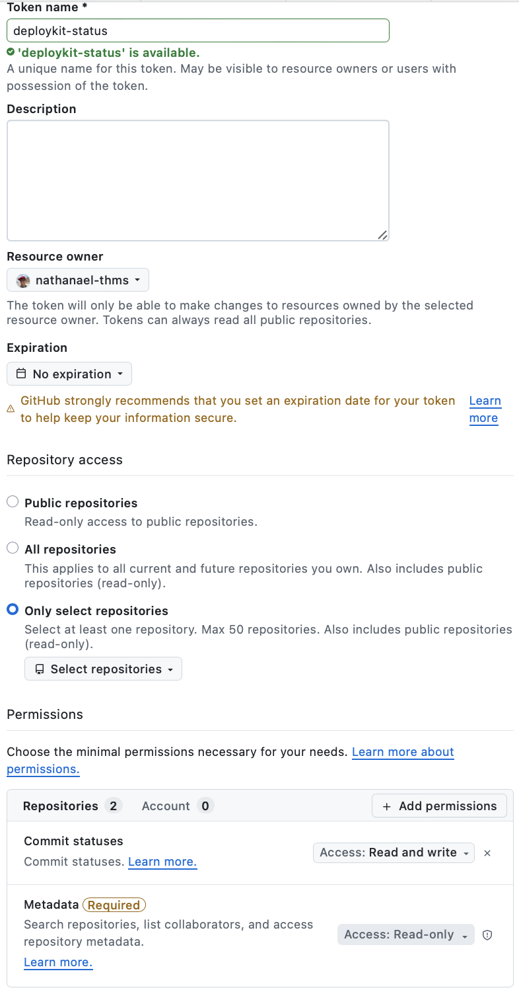
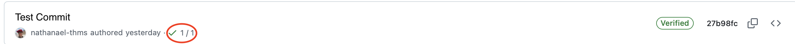
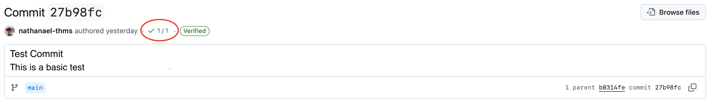

# Webhook listener

!!! info
    php-deploykit as a command means the run.sh script from its installation location. If you created a symlink into PATH, php-deploykit (or the name you chose). Otherwise the script using the full path to the run.sh file.

The webhook listener listens for incoming webhook requests and triggers deployments when a request is received. It uses the `WEBHOOK_PORT`, `WEBHOOK_SECRET`, and `WEBHOOK_PROVIDER` variables in `.env` to determine how to listen for requests and verify them. It is recommended to run the webhook listener via a systemd service.

## Install as a service(recommended)

To install the webhook listener as a systemd service, run php-deploykit --webhook-service-install or select the corresponding option from the menu. This runs the `utilities/webhook_listener_service_install.sh` script, which creates a systemd service file for the webhook listener and starts the service. The service is configured to start on boot and restart automatically if it fails.

To remove, run `php-deploykit --webhook-service-uninstall` or select the corresponding option from the menu. This stops the service, disables it from starting on boot, and removes the service file.

## Manual start

To start the webhook listener manually, run `php-deploykit --webhook-listener`. This calls `webhook_listener/webhook_listener.sh`, which starts the webhook listener. No human interaction is needed after running the command, but you must keep the terminal open to keep the listener running. It is recommended to use a systemd service instead to avoid this issue and ensure the listener is always running when needed.

## Reporting deployment status back to GitHub

If you are using the webhook listener with GitHub and have `GITHUB_REPORTING="true"` in `.env`, the script reports deployment status back to GitHub, which can be viewed by checking the repository's commits. Fill in the `GITHUB_TOKEN`, `GITHUB_REPO_NAME` and `GITHUB_REPO_OWNER` variables in `.env`, below are steps for creating a GitHub token with the necessary permissions.

### Create your token

1. Go to your GitHub account settings, then Developer settings, then Fine-grained tokens(under personal access tokens)

2. Click "Generate new token"

3. Give it a name, like deploykit status, and optionally give it a description and expiry date. Under Repository access, select "Only select repositories", under select repositories, select the repository you want to deploy. Under Permissions, click on Repositories, then add permissions, select "Commit Statuses, then, under the access dropdown, select "Read and write". Leave metadata as it is. Then click "Generate token" at the bottom of the page.

4. Copy the generated token and paste it into `GITHUB_TOKEN` in your `.env` file.

5. Restart the webhook listener via systemctl to apply the changes.

Below is a screenshot of the permissions that should be set for the token(Note you must select a repo):

### Viewing deployment status in GitHub

1. Go to the GitHub repository you are deploying.
2. Click on "Commits"
3. Click on the commit you want to check the deployment status for.
4. At the top, you will see a small tick, a red cross, or a grey dot next to the commit message. A tick means the deployment was successful, a red cross means it failed, and a grey dot means the deployment is in progress. You can click on the symbol to view more details about the deployment status. If you have other checks enabled, click and see the one called "Deployment" to view the deployment status.

If you do not see any deployment status, make sure you have set `GITHUB_REPORTING="true"` in `.env`, filled in `GITHUB_TOKEN`, `GITHUB_REPO_OWNER`, and `GITHUB_REPO_NAME` correctly, and restarted the webhook listener via systemctl. You may want to enable webhook logging temporarily to debug and make sure the deploykit is able to communicate with GitHub's API.

Deployment status reporting is only available for GitHub; it is not supported for GitLab or Bitbucket.

!!! note
    This is only for push webhook events, not the ping ones

Below is an example of what the deployment status looks like on GitHub:

And when clicking on the sha:

When clicking on the tick, you will see the message: `Deployment - Deployment succeeded`

If it does not work, you may want to temporarily set `LOG_WEBHOOK="true"` in `.env` to log incoming webhook requests, then check the logs to debug and make sure the deploykit is able to communicate with GitHub's API. Remember to restart the webhook listener via systemctl after changing the .env variables.